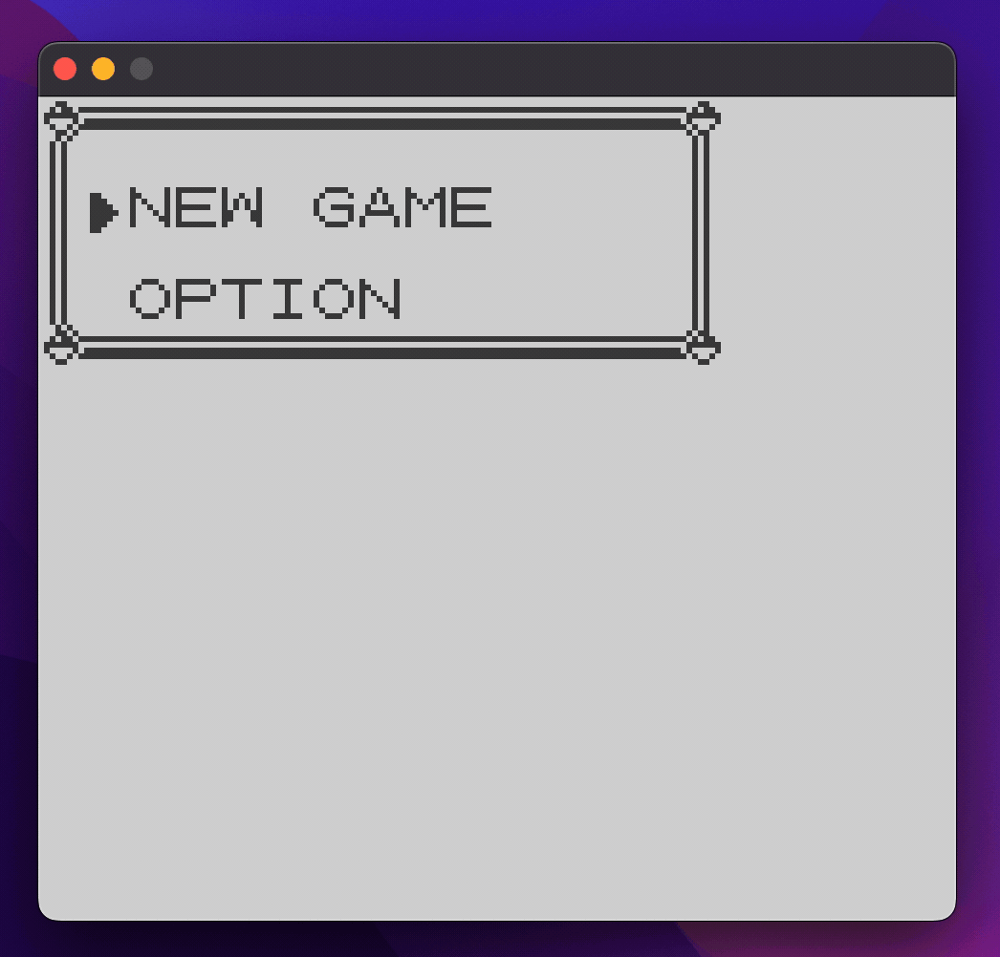

# Gameboy Doctor

Are you [building a Gameboy emulator](https://gbdev.io/pandocs/)?



Are you stuck? Are you failing [Blargg's test ROMs](https://github.com/retrio/gb-test-roms) and can't work out why?

Gameboy Doctor can help!


## What is Gameboy Doctor?

Gameboy Doctor is a tool that compares your emulator to an example emulator that passes Blargg's test ROMs. It finds the exact tick where your emulator's state diverges from the example, helping you isolate and fix your bugs. You don't need to have implemented an LCD in order to use it, and you don't even have to be able to successfully get any kind of pass/fail message back from Blargg! All you need is a minimally functional CPU and motherboard.

## Requirements

Just Python3, no third-party libraries.

## How do I use Gameboy Doctor?

### 1. Choose a test ROM

Choose a [`cpu_instrs` individual test ROM](https://github.com/retrio/gb-test-roms/tree/master/cpu_instrs/individual) (these are currently the only ones supported by Gameboy Doctor - see below)

### 2. Make 2 tweaks to your emulator

You'll need to make 2 changes to the internal workings of your emulator. They'll probably take about 20 minutes to do, but they'll save you hours and days of aimless debugging. The changes are:

* Initialize the CPU's state to the state it should have immediately after executing the boot ROM:

| Register | Value |
| ----------- | ----------- |
|A|0x01|
|F|0xB0 (or `CH-Z` if managing flags individually)|
|B|0x00|
|C|0x13|
|D|0x00|
|E|0xD8|
|H|0x01|
|L|0x4D|
|SP|0xFFFE|
|PC|0x0100|

* Hardcode your LCD (or your motherboard's memory map if you haven't implemented an LCD yet) to return `0x90` when the `LY` register is read (memory location `0xFF44`). This is what I did when generating my example logs, because returning a constant prevent spurious log divergences.

### 3. Log the state of your CPU

Next, update your emulator to write the state of the CPU after each executed opcode to a logfile. Use a new line for each tick, and use the following format for each state (replace the example numbers with your CPU's values):

```
A:00 F:11 B:22 C:33 D:44 E:55 H:66 L:77 SP:8888 PC:9999 PCMEM:AA,BB,CC,DD
```

All of the values between `A` and `PC` are the hex-encoded values of the corresponding registers. The final value (`PCMEM`) is the 4 bytes stored in the memory locations near `PC` (ie. the values at `pc,pc+1,pc+2,pc+3`).

Run your emulator and get a log file. You can kill the program at any point - Gameboy Doctor will tell you if your log file is correct but ends before the test ROM has finished its assertions. If you pass the test then your emulator will display the word "Passed" on the LCD, and write the bytes for the word "Passed" to [the serial output](https://gbdev.io/pandocs/Serial_Data_Transfer_%28Link_Cable%29.html). However, you don't need to pass or even finish the tests in order to use Gameboy Doctor.

**Note about 02-interrupts:** Make sure you don't write a log on every update, only if the CPU is not halting and executed an opcode.

### 4. Feed your logfile to Gameboy Doctor

Once you have your logfile, feed it into Gameboy Doctor like so:

```
./gameboy-doctor /path/to/your/logfile $ROM_TYPE $ROM_NUMBER
```

For example, to check the 3rd cpu_instrs ROM:

```
./gameboy-doctor /path/to/your/logfile cpu_instrs 3
```

On windows you may need to invoke the Python interpreter directly:

```
python3 gameboy-doctor /path/to/your/logfile cpu_instrs 3
```

Alternatively, you can pipe your program's output directly into Gameboy Doctor by setting the logfile path to `"-"` like so:

```
your-emulator | gameboy-doctor - cpu_instrs 3
```
Gameboy Doctor will tell you how you're doing and give suggestions on bugfixes. For example:

```
$ ./gameboy-doctor ../my-emulator/logs/3.log cpu_instrs 3
============== ERROR ==============

Mismatch in CPU state at line 9997:

MINE:   A:3E F:C--- B:01 C:07 D:C9 E:BA H:49 L:BB SP:FFFE PC:0208 PCMEM:1C,20,FB,14
YOURS:  A:3D F:C--- B:01 C:07 D:C9 E:BA H:49 L:BB SP:FFFE PC:0208 PCMEM:1C,20,FB,14

The CPU state before this (at line 9996) was:

	      A:3E F:10 B:01 C:07 D:C9 E:BA H:49 L:BB SP:FFFE PC:0207 PCMEM:12,1C,20,FB

The last operation executed (in between lines 9996 and 9997) was:

	      0x12 LD (DE) A

Perhaps the problem is with this opcode, or with your interrupt handling?
```

Eventually you'll hopefully see:

```
$ ./gameboy-doctor ../my-emulator/logs/3.log cpu_instrs 3
============== SUCCESS ==============

Your log file matched mine for all 1066160 lines - you passed the test ROM!
```

## Future Work

Gameboy Doctor currently only supports Blargg's `cpu_instrs` test ROMs because these are the most useful for initial debugging. It should be relatively easy to support other test ROMs, although small timing differences that don't affect the successful running of the emulator may cause divergences in CPU states between otherwise well-functioning emulators.

Let me know if you find Gameboy Doctor useful and I'll work on expanding the ROMs and emulators it supports.

## Acknowledgements

This tool was inspired by [GitHub user wheremyfoodat](https://github.com/wheremyfoodat/Gameboy-logs).
